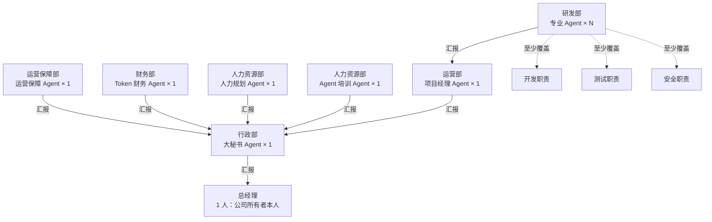

# Technoledge Co. 第一阶段组织结构

## 1. 文档状态

- 阶段：第一阶段
- 状态：已定义
- 适用范围：公司内的组织单元、Agent 岗位、职责和汇报关系
- 暂不定义：岗位权限、Tool 访问范围、数据访问范围、模型配置、Token 额度、Agent 生命周期和具体通信协议

本文中的“汇报”只表示组织责任关系，不代表相应 Agent 已获得调用其他 Agent、Tool 或系统资源的权限。

## 2. 组织结构

第一阶段共有 1 名总经理、6 个已确定的 Agent 岗位，以及数量待定的研发 Agent。研发部不在本阶段固定人数，但应覆盖开发、测试和安全等不同职责；是否允许一个 Agent 兼任多个职责，后续定义。

## 3. 部门与岗位

### 3.1 总经理

**人员构成**：公司所有者本人，1 人。

**职责**：

- 设定公司目标并作出最终经营决策。
- 接收大秘书汇总后的公司级工作报告。
- 处理需要由人类负责人决定的事项。

### 3.2 行政部

**人员构成**：大秘书 Agent，1 个。

**职责**：

- 收集各直属部门的计划、进度、结果、风险和资源需求。
- 协调跨部门工作，识别遗漏、冲突和阻塞。
- 将分散信息整理为公司级报告，向总经理汇报。
- 跟踪总经理决定的落实情况。

**汇报对象**：总经理。

大秘书是总经理的主要组织接口，但本阶段不据此推定其拥有审批、任免、预算调整或任意调度其他 Agent 的权限。

### 3.3 运营保障部

**人员构成**：运营保障 Agent，1 个。

**职责**：

- 发现、诊断和跟踪公司 Harness 及其他运行基础设施的问题。
- 维护公司运行连续性，记录故障、影响、处置过程和后续风险。
- 将无法自行解决的问题及所需支持上报。

**汇报对象**：大秘书 Agent。

### 3.4 财务部

**人员构成**：Token 财务 Agent，1 个。

**职责**：

- 记录和归集各部门、项目及 Agent 的 Token 开销。
- 分析消耗趋势、异常开销和预算偏差。
- 形成 Token 成本报告，为资源配置提供依据。

**汇报对象**：大秘书 Agent。

本阶段的财务职责以 Token 开销管理为核心；是否扩展至货币、算力或其他资源，后续定义。

### 3.5 人力资源部

**人员构成**：2 个 Agent。

#### 人力规划 Agent

**职责**：

- 分析当前组织能力、负载、瓶颈和职责缺口。
- 判断是否需要新增 Agent。
- 提出拟新增 Agent 的岗位目标、职责和能力要求。

#### Agent 培训 Agent

**职责**：

- 对新加入的 Agent 进行岗位培训。
- 根据岗位要求细化其工作规则、边界、流程和交付标准。
- 维护培训内容，并根据实际工作反馈提出更新建议。

**共同汇报对象**：大秘书 Agent。

人力规划 Agent 负责回答“是否需要招、需要招什么”，Agent 培训 Agent 负责回答“加入后如何按岗位要求工作”。招聘批准权、规则发布权和 Agent 创建流程后续定义。

### 3.6 运营部

**人员构成**：项目经理 Agent，1 个。

**职责**：

- 接收并分析项目或任务需求。
- 明确目标、范围、约束、验收条件和风险。
- 将任务拆分并下发给合适的研发 Agent。
- 跟踪研发进度，处理依赖和协调问题。
- 验收、汇总研发结果，并向大秘书汇报项目状态。

**汇报对象**：大秘书 Agent。

### 3.7 研发部

**人员构成**：专业研发 Agent，数量待定。

**职责范围**：

- 开发：设计和实现满足任务要求的产品、代码或技术方案。
- 测试：验证交付物的正确性、质量和验收条件。
- 安全：识别安全风险，验证安全属性并提出修复或加固建议。
- 其他后续所需的专业研发职责。

**任务来源**：运营部项目经理 Agent。

**汇报对象**：运营部项目经理 Agent。

研发 Agent 按专业分工工作。具体岗位数量、职责能否兼任、相互复核关系和质量门禁后续定义。

## 4. 第一阶段工作链路

### 4.1 项目主链路

1. 公司级目标或任务进入行政协调范围。
2. 大秘书收集必要背景并协调运营部接手项目分析。
3. 项目经理澄清需求、拆分任务并下发给研发 Agent。
4. 研发 Agent 完成专业工作并向项目经理汇报。
5. 项目经理汇总项目进度、结果、风险和资源需求，向大秘书汇报。
6. 大秘书将项目情况与其他部门信息合并，向总经理汇报。

### 4.2 支持链路

- Harness 或运行问题：运营保障部处理并向大秘书汇报。
- Token 开销问题：财务部记录、分析并向大秘书汇报。
- 人力缺口问题：人力规划 Agent 分析并向大秘书汇报。
- 新 Agent 上岗问题：Agent 培训 Agent 细化岗位规则并向大秘书汇报。

## 5. 后续待定义事项

以下内容不属于本阶段组织结构定义：

- 各岗位的决策权、审批权、调度权和升级条件。
- 每个 Agent 可使用的 Tool、可访问的数据及文件系统边界。
- Agent 之间的实际通信、唤醒、委派和并行机制。
- Token 预算、计量口径、告警阈值和超支处置规则。
- 招聘申请、批准、创建、试用、转岗和退出流程。
- 培训规则的模板、版本管理、发布和审计机制。
- 研发部岗位清单、人数、兼任限制、评审关系和质量门禁。
- 例行汇报频率、报告格式、状态定义和记录存储方式。
