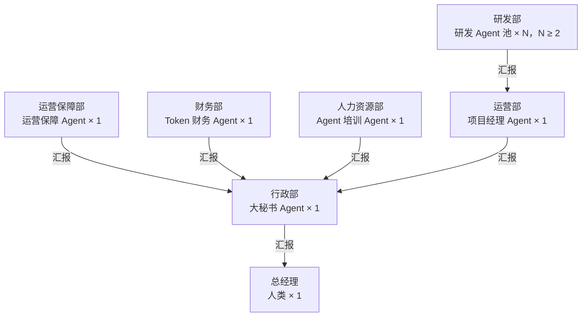

# Technoledge Co. 首版组织结构

## 1. 文档状态

- 组织阶段：1
- 状态：已定义，并按 M3 运行设计更新
- 适用范围：公司的部门、岗位、职责、汇报关系和工作分配来源
- 唯一组织真相：`packages/company/spec/organization.yaml`

本文只定义组织责任。实际通信、Agent 实例、Tool、数据权限和运行机制由 M3 运行设计及后续实现负责。汇报关系不自动授予操作权限。

## 2. 组织结构



首版共有 1 名人类总经理、5 个固定 Agent 岗位和一个至少包含 2 个 Agent 的研发岗位池。所有对人的公司级交互都经过大秘书，研发工作由项目经理统一组织。

## 3. 岗位职责

### 3.1 总经理

总经理是公司所有者和人类决策端点，负责：

- 提出目标、项目和查询请求。
- 决定超出既有授权范围的重大事项。
- 批准越界、不可逆、外部发布、付款、凭证和组织权限变更。
- 接收大秘书的同步回复和异步通知。

### 3.2 大秘书

大秘书是总经理的唯一主要交互入口和公司的主 Agent，负责：

- 在 Pi 会话中接收并澄清总经理的请求。
- 根据岗位职责和上下文判断接收岗位，派发任务并取得结果。
- 维护公司级任务视图，汇总专业岗位返回的信息。
- 在当前会话内回复短任务结果。
- 为后台任务终态、待决事项和系统 fatal 异常排队并发送受限邮件通知。

大秘书不代替项目经理开发软件，不代替财务查询账本，不代替运营保障修复系统，也不代替 Agent 培训专员修改 Agent 配置。无法匹配现有岗位的请求必须说明能力缺口并请总经理决定。

### 3.3 项目经理

项目经理只负责软件工程和代码项目，负责：

- 接收大秘书派发的软件项目并澄清目标、约束和验收条件。
- 进行只读技术预研并形成内部 Plan。
- 设计项目架构、开发安排、测试方案、验收方式和风险控制。
- 选择、拆分和委派研发 Subagent 工作。
- 根据测试、独立复核和项目成果作出最终技术验收。
- 将项目结果、证据、剩余风险和必要文档交回大秘书。

总经理的原始项目指令即授权项目经理在指定项目工作区内开展常规开发。项目经理无需把内部 Plan 再提交总经理批准，但范围扩大、高危操作或新增资源需求必须请示。

### 3.4 研发岗位池

研发岗位池包含通用软件研发 Agent，由项目经理调度，必须覆盖以下能力：

- `developer`：架构和代码实现。
- `tester`：测试设计、执行和缺陷验证。
- `security-engineer`：按项目风险完成必要的安全分析。
- `reviewer`：独立、只读地复核代码和验证证据。

这些是能力覆盖，不要求四个固定专岗。一个通用 Agent 可以覆盖多个能力，但一次代码交付的 reviewer 必须是未参与该成果编写的另一个调用实例。研发岗位池至少包含 2 个 Agent，以保证作者与复核者可以分离。

### 3.5 Token 财务专员

Token 财务专员只负责 Token 成本事实，负责：

- 使用只读 SQLite 连接查询成本账本和必要的归属视图。
- 按 Agent、部门、项目、Provider、Model 和时间等维度统计 Token。
- 根据总经理请求解释口径、汇总结果和数据缺口。

模型调用的 `CostRecord` 由运行系统自动追加。财务不能修改或补写账本，首版不执行软预算或硬预算控制，也不扩展到通用货币会计。

### 3.6 运营保障专员

运营保障专员只维护公司 Agent 系统的运行，负责：

- 检查健康状态、日志和计划内单元测试。
- 诊断公司运行系统故障并形成最小修复。
- 修改公司 Agent 系统代码或配置，运行验证并调用独立只读 reviewer。
- 将通过验证的候选修复提交给独立 Supervisor 应用。

运营保障不负责总经理委托的普通软件项目。Supervisor 是公司运行时之外的确定性控制组件，不是组织岗位；它负责启动、重启、健康检查和失败回滚，避免运营保障 Agent 在重启自身所在进程时失去控制。

### 3.7 Agent 培训专员

首版人力资源部只保留 Agent 培训专员，原人力规划职责并入该岗位。其负责：

- 根据总经理要求设计岗位目标、职责和能力边界。
- 编写和维护 Agent Prompt、Skill、`AGENTS.md` 和 Agent 定义。
- 检查配置格式、引用、权限边界和必要的行为验证。
- 在既有职责和权限内直接应用通过检查的常规配置变更。

培训专员不能自行扩大 Tool 或数据权限、修改组织结构或接入凭证；这些变化必须由总经理批准。

## 4. 首版工作链路

### 4.1 软件项目

```text
总经理 → 大秘书 → 项目经理 → 研发 Subagent → 独立 reviewer
       ← 大秘书 ← 项目经理验收 ← 测试与复核结果
```

短任务可以在当前 Pi 会话中完成。需要长期开发的项目转入后台，项目经理负责从规划到验收，大秘书只负责交接和最终通知。

### 4.2 支持业务

- Token 查询：总经理 → 大秘书 → Token 财务专员 → 大秘书 → 总经理。
- 系统故障：健康检查或测试 → 运营保障专员 → reviewer → Supervisor → 大秘书通知。
- Agent 配置：总经理或大秘书 → Agent 培训专员 → 检查并应用 → 大秘书汇报。
- 能力缺口：大秘书说明无匹配岗位 → 总经理决定是否要求培训专员设计新 Agent。

## 5. 组织边界

- 岗位职责决定任务归属，但不直接授予 Tool、文件、数据库或外部系统权限。
- 大秘书是信息与任务入口，不是所有专业工作的兜底执行者。
- 项目经理只承接软件工程工作，研发 Agent 只接受项目经理的项目任务。
- 财务只读取成本数据，运营保障只维护公司系统，人力资源只维护 Agent 设计与配置。
- 员工定义不得保存密钥、数据库地址或可绕过运行系统的权限逻辑。
- 具体运行、审批和异步通知规则以 `RUNTIME_DESIGN.md` 为准。
