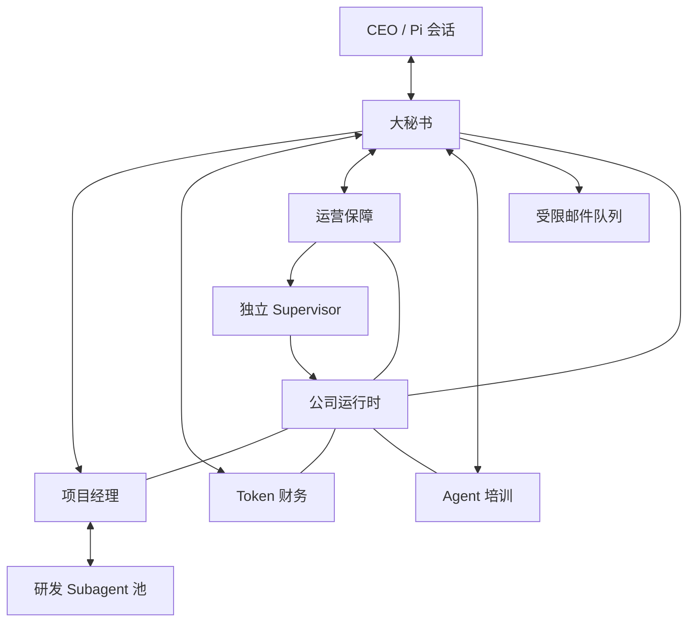

# Technoledge Co. M3 运行设计

## 1. 文档状态

- 里程碑：M3 首版公司运行设计
- 状态：已完成
- 完成日期：2026-08-14
- 上游依据：`organization.yaml`、`ORGANIZATION.md`、`DATA_CONTRACTS.md` 和 `BUSINESS_CATALOG.md`
- 下游用途：指导 M4 实现 SQLite、任务控制、Tools、员工 Agent、后台运行、邮件队列和 Supervisor

本文是 M3 的权威运行设计。M3 只确定职责、主流程、授权和组件边界，不实现通信协议、数据库、邮件 Provider、Agent 定义或进程管理器。

## 2. 设计目标

首版公司必须能够表达以下逻辑：

```text
CEO 在 Pi 会话提出请求
  → 大秘书理解并派发
  → 专业岗位或项目经理负责
  → 项目经理调用研发 Subagent 完成软件项目
  → 专业岗位把顶层结果回调给大秘书
  → 大秘书在 Pi 会话回复，或按规则发送异步邮件
```

设计遵守以下原则：

1. 软件项目是公司的主业务，其他部门只维持公司运行和人机交互。
2. 大秘书负责路由与汇总，不成为全能执行者。
3. 项目经理负责软件工程判断，现有 Pi Agent 负责具体技术工作。
4. Agent 负责判断，运行系统负责权限、持久状态和可靠执行。
5. 未明确授权的越界或外部副作用默认拒绝。
6. M4 复用现有 Pi `subagent` 扩展能力，不复制其执行器。

## 3. 逻辑组件



公司运行时保存任务、消息、Artifact 引用、审批、成本和审计事实，并在所有 Tool 和外部操作入口检查权限。Supervisor 位于公司运行时之外，即使公司 Agent 进程退出或卡死，仍能启动、检查和回滚运行时。

## 4. 请求与任务模式

### 4.1 当前会话任务

CEO 通过当前 Pi 会话与大秘书交互。大秘书判断任务归属并调用相应专业岗位。能够在会话期内完成的查询取得结果后直接回复 CEO，例如按模型和部门查询 Token 消耗。

专业岗位的回复仍返回大秘书。大秘书可以整理和解释结果，但不能替专业岗位产生事实或执行受限操作。

### 4.2 后台顶层任务

需要正式开发或长时间执行的请求进入后台：

1. 大秘书保留 CEO 原始请求，建立可追溯的顶层任务并交给项目经理。
2. 项目经理确认接收后，当前 Pi 会话可以结束；任务不依赖会话上下文继续存在。
3. 项目经理创建和管理研发子任务，子任务状态只回到项目经理。
4. 项目经理完成技术验收、决定最终失败或需要 CEO 决策时，向大秘书发出顶层回调。
5. 大秘书把允许的事件加入邮件队列。即使 CEO 此时正在另一个 Pi 会话中，后台终态仍按邮件规则交付。

普通研发子任务的成功、失败、中止和重试由项目经理处理，不直接打扰 CEO。

### 4.3 无匹配岗位

不属于软件工程、Token 财务、公司运维或 Agent 配置的请求，不得由大秘书或项目经理兜底。大秘书应说明当前能力缺口，请 CEO 选择停止、调整目标，或要求 Agent 培训专员设计新岗位和 Agent。

## 5. 软件项目交付

### 5.1 项目授权

CEO 的原始软件项目指令是当前顶层任务的开发授权。它允许项目经理和研发 Agent 在指定项目工作区内：

- 读取和修改项目文件。
- 运行常规开发、测试、检查和构建命令。
- 创建本地 Git 分支和提交。
- 调用已配置的研发 Subagent 完成项目工作。

项目经理无需把内部 Plan 再提交 CEO 批准。以下变化仍须请示：

- 目标、范围或验收条件发生实质变化。
- 需要访问项目工作区之外的文件或系统。
- 需要重要数据删除、外部写入、额外付费资源或凭证。
- 需要 push、创建 PR、合并、部署或发布。

如果 CEO 的原始指令已明确写出高危动作、目标和范围，该指令同时构成当前顶层任务的授权；执行范围变化或扩大时必须重新申请。

### 5.2 专业开发流程

项目经理对软件项目采用以下最小质量流程：

1. 明确目标、范围、约束和可观察的验收条件。
2. 必要时调用只读 Subagent 进行代码勘察或技术可行性分析。
3. 形成内部 Plan，至少覆盖项目架构、任务拆分、测试、验收和主要风险。
4. 根据项目特点选择单任务、并行或链式研发委派，不固定唯一执行顺序。
5. 运行适用的自动化测试和项目检查。
6. 使用未参与成果编写的另一个调用实例进行独立只读复核。
7. 项目经理基于完整成果、测试和复核结果作出技术验收。
8. 形成顶层完成报告，包含成果位置、验证证据、剩余风险和必要的使用说明。

所有代码项目都必须完成测试和独立复核。专项安全检查由项目风险决定；研发岗位池必须具备安全分析能力，但不要求每个简单项目运行独立安全流程。

### 5.3 中断与恢复

公司运行时重启时，不假设能够恢复正在生成中的模型响应。正在执行的研发调用标记为中断，已经保存的顶层任务、输入、Artifact 和已完成结果保留。

项目经理恢复后读取中断事实，自主选择：

- 使用原输入重试。
- 调整任务或更换 Agent。
- 使用已有部分成果继续。
- 将顶层任务标记为最终失败。

系统不得自动从头重试所有中断调用，也不得把中断伪装成连续执行。

## 6. 岗位权限边界

| 主体 | 默认允许 | 默认拒绝或需 CEO 批准 |
|---|---|---|
| 大秘书 | 读取组织和公司级任务摘要；派发任务；接收顶层结果；在 Pi 回复；发送限定 CEO 邮件 | 直接开发、修改账本、修复系统、修改 Agent 配置、给其他外部收件人发信 |
| 项目经理 | 管理软件项目、内部 Plan、研发子任务和项目工作区；调用研发 Subagent | 非软件任务、公司配置、凭证、越界文件、未经授权的外部 Git 或发布操作 |
| 研发 Agent | 当前子任务所需的项目工作区和工具；返回结果与证据 | 扩大自身工具和数据权限；修改公司组织或凭证；执行未授权外部副作用 |
| Token 财务 | 对成本账本和归属视图执行只读 SQL；统计和说明 Token | 修改账本；读取消息、Prompt、源码或凭证；执行预算停止 |
| 运营保障 | 读取并修改公司 Agent 系统工作区；运行测试；调用只读 reviewer；请求 Supervisor 应用 | 普通业务项目；直接控制宿主进程；删除运行数据、改凭证或外部发布 |
| Agent 培训 | 设计岗位；修改 Prompt、Skill、`AGENTS.md` 和 Agent 定义；应用常规变更 | 自行扩大权限、修改组织、接入或读取凭证 |
| 公司运行时 | 自动追加成本和审计；检查权限；保存状态；调度受控操作 | 代替 Agent 作业务判断；向 Agent 暴露明文凭证 |
| Supervisor | 启动指定版本；执行健康检查；应用已验证修复；失败回滚 | 执行业务任务；解释自然语言授权；直接修改业务数据 |

汇报关系和任务派发均不扩大接收方权限。项目经理给 Subagent 的任务文本、项目级 Agent 定义和 Prompt 不能覆盖运行系统的 Tool、文件、网络、凭证或外部操作边界。

## 7. 审批规则

### 7.1 必须审批的动作

除非 CEO 原始指令已明确授权，以下动作必须先取得批准：

- 访问或修改获派工作区之外的文件和系统。
- 删除重要数据或执行难以恢复的操作。
- Git push、创建 PR、合并、部署、发布和其他外部写入。
- 付款、Token 充值或使用新的付费资源。
- 读取、创建、轮换或接入凭证。
- 扩大 Agent 的 Tool、数据、网络或组织权限。
- 修改组织结构或启用新的高权限 Agent。

### 7.2 授权范围

- 默认授权只对申请中明确的一次操作有效。
- CEO 可以明确授权当前顶层任务中的同范围操作。
- 长期放行必须作为独立策略变更处理，不能从模糊自然语言推断。
- 实际动作的目标或范围与批准内容不一致时，运行系统拒绝并记录原因。
- 拒绝和待审批均不得被 Agent 指令、委派或 Prompt 绕过。

### 7.3 预授权邮件

大秘书向配置的 CEO 地址发送本设计规定的后台顶层通知和 fatal 通知属于预授权外部写入。该授权不包括其他收件人、营销邮件、任意附件或与公司事件无关的内容。

## 8. 异步邮件

### 8.1 入队事件

只有以下事件进入 CEO 邮件队列：

- 后台顶层任务完成。
- 后台顶层任务最终失败。
- 后台顶层任务等待 CEO 决策或授权。
- 公司 Agent 系统出现已确认的 fatal 异常。

研发子任务、普通重试、内部状态更新和非 fatal 测试失败不直接产生 CEO 邮件。

### 8.2 发送门禁

下一封邮件只有同时满足以下条件才能发送：

1. 上一封已发送邮件已由 CEO 确认。
2. 距上一封成功发送至少一小时。

CEO 可以通过回复对应邮件或在 Pi 会话中明确确认来解除确认门禁。若 CEO 在满一小时前确认，系统仍等待剩余时间；若在满一小时后确认，系统可以立即发送下一封聚合邮件。

fatal 异常不绕过确认或一小时间隔。CEO 可以明确修改频率或解除门禁，运行系统应记录该决定。

### 8.3 聚合与失败

- 门禁关闭期间，事件保存在持久队列中，不覆盖或丢弃。
- 门禁重新打开时，大秘书把全部待发送事件聚合为一封摘要，保留每个顶层任务或事故的独立标识和结果。
- 同一 fatal 事故在邮件尚未发送前恢复时，摘要应同时说明异常和恢复结果。
- 邮件 Provider 未接受发送时，事件保持未发送状态，不能开启下一封邮件的确认等待。
- 即使 CEO 正在新的 Pi 会话中，后台事件仍发送邮件；Pi 会话不是后台通知的替代渠道。
- 邮件正文不得包含凭证、完整 Prompt、无必要的源码、日志或敏感路径。

## 9. Token 成本

每次模型调用取得最终 usage 后，运行系统必须追加一条 `CostRecord`，至少关联 Agent、Provider、Model 和记录时间，并尽量关联 Project、Task 与 ToolInvocation。重复事件不得重复记账，缺失 usage 不得用猜测数据替代。

财务使用只读 SQLite 连接访问：

- 原始 `CostRecord`。
- Agent 到 Position 和 Department 的归属视图。
- Project 和 Task 的成本归属视图。

财务可以执行任意只读 SQL，但连接不得暴露业务消息、Prompt、Artifact 内容、凭证或可写表。首版只记录和查询 Token，不设置项目、部门或 Agent 的软预算与硬预算，也不把 Pi 估算金额当作供应商实际账单。

## 10. 故障修复与 Supervisor

Supervisor 是非 Agent、独立于公司运行时的控制组件。运营保障和 Supervisor 的最小协作如下：

1. 健康检查或计划内单元测试发现公司系统故障。
2. 运营保障在限定工作区形成候选修复。
3. 相关测试通过，且独立只读 reviewer 未发现阻断问题。
4. 运营保障提交候选版本和验证证据，不能直接重启宿主进程。
5. Supervisor 记录当前已知可用版本，应用候选版本并重启公司运行时。
6. Supervisor 执行启动和健康检查；成功则确认新版本，失败则恢复上一个已知可用版本并再次启动。
7. 恢复或回滚结果写入事故状态，由大秘书按邮件门禁通知 CEO。

删除数据、修改凭证、改变数据库结构、外部发布或无法安全回滚的修复不在自动应用范围内，必须由 CEO 明确批准。

## 11. M4 实现边界

M4 必须实现但 M3 不创建的能力包括：

- SQLite 运行记录、迁移和只读财务视图。
- 顶层任务、父子任务、内部消息、Artifact、审批、成本和审计控制。
- 岗位 Agent 定义、受控 Tools 和 Position 到 Agent 的绑定。
- 现有 Pi `subagent` 扩展的安装、版本锁定、身份映射和结果适配。
- 与 Pi 会话解耦的后台任务执行及中断恢复。
- 持久邮件队列、确认关联、聚合和一小时门禁。
- 独立 Supervisor、健康检查、候选版本切换和回滚。
- 运行时凭证注入；数据库和 Agent 只保存不透明凭证引用。

M3 不决定邮件供应商、SQLite 文件路径、Supervisor 进程管理器或具体 Tool 名称，这些选择在 M4 根据部署环境确定。

## 12. M3 验收推演

以下场景均能按本设计得到唯一责任方和确定结果，M3 即通过：

1. CEO 在 Pi 查询 Token：大秘书交给财务，财务只读查询并在当前会话返回。
2. CEO 安排长期软件项目：项目经理后台规划、委派、测试、复核、验收，大秘书邮件通知顶层结果。
3. 研发调用被重启中断：系统记录中断，项目经理决定重试、调整或最终失败。
4. 项目需要 push 或发布：若原指令未明确授权，执行前提交 CEO；未批准不得执行。
5. 单元测试出现 fatal：运营保障修复、测试、独立复核，Supervisor 重启并在失败时回滚。
6. 多个后台结果连续产生：上一封未确认或间隔不足一小时均不发送，事件聚合后在门禁打开时一次发送。

这些推演验证设计完整性，不代表对应运行实现已在 M3 完成。
